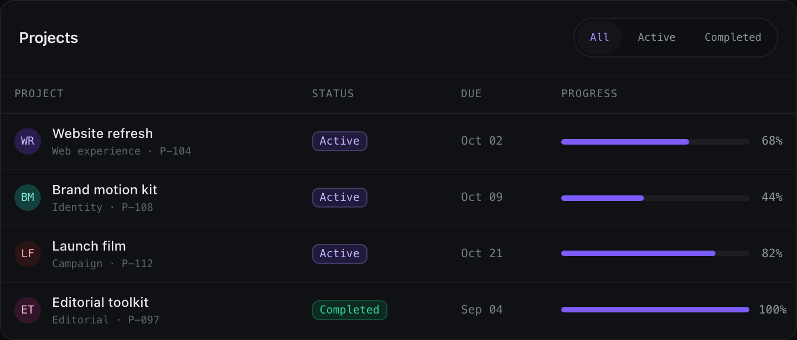

# mob-design

`mob-design` is a CSS design system for dense product interfaces: account areas, settings,
tables, analytics, and internal tools. The name does not mean “mobile only.” The same system
works from a narrow phone to a wide workstation screen.

It provides tokens, themes, typography roles, components, and visual states. Application
behavior stays in the application: this library does not implement routes, requests, validation,
sorting, focus traps, or menu controllers.



## Why use it

- Give a new product or an incremental redesign one visual language.
- Keep numbers, statuses, and actions readable on information-heavy screens.
- Use dark and derived light themes plus three density modes without a build step.
- Ship plain CSS with no runtime dependencies, generated classes, or required framework.
- Give people and coding agents a searchable, testable contract for classes and tokens.

It is most useful when a team wants to change presentation centrally while preserving an
application's handlers, data, locale, numerical precision, and accessible behavior.

## Preview locally

You need Node.js 18 or newer. No `npm install` is required. If the repository is private, clone it
through an authenticated GitHub account.

```bash
git clone https://github.com/DIZRAID/mob-design.git
cd mob-design
npm run preview
```

Open `http://127.0.0.1:4173/`; the server redirects to the interactive project overview.

- [Open the local starter](http://127.0.0.1:4173/examples/starter/) for a working project overview
  with filters, task progress, theme and density controls, and local project
  creation without a backend.
- [Open the local showcase](http://127.0.0.1:4173/showcase/) for the broad component and state
  catalogue. It is a visual reference rather than a working product.

Any local HTTP server also works:

```bash
python3 -m http.server 4173 --bind 127.0.0.1
```

Then open `http://127.0.0.1:4173/examples/starter/`. Do not open the files by double-clicking them;
HTTP resolves the relative CSS imports and ES modules correctly.

## Add it to an application

Keep `mob-design` inside the project as `vendor/mob-design`, a git submodule, or a local package
dependency. Import it once from your own CSS entry point. An `@import` path is relative to the
stylesheet that contains it.

For a separate application or a deliberate application-wide migration:

```css
/* src/styles/app.css */
@layer mob, app;
@import url('../../vendor/mob-design/css/mob.css') layer(mob);

@layer app {
  .account-shell {
    max-inline-size: var(--mob-container-app);
    margin-inline: auto;
  }
}
```

`mob.css` includes the reset, global base, components, and utilities, so it affects the whole
document. Do not import it globally just to redesign one screen in a mature application.

For incremental adoption without the reset or global body, link, scrollbar, and focus rules:

```css
@layer mob, app;
@import url('../../vendor/mob-design/css/tokens.css') layer(mob);
@import url('../../vendor/mob-design/css/roles.css') layer(mob);
```

Start with `.mob-title`, `.mob-body`, `.mob-value`, and `.mob-meta`, then import the component
styles you need. With selective imports, the host must retain its control normalization,
`:focus-visible`, reduced-motion policy, and large touch targets.

See [the agent workflow](docs/agent-workflow.md) and [the adoption guide](docs/09-adoption.md)
for the complete migration order.

## Your first component

```html
<article class="mob-card">
  <header class="mob-card__header">
    <h2 class="mob-card__title">Profile</h2>
  </header>
  <div class="mob-card__body">
    <p class="mob-body">Review the name and time zone.</p>
    <button class="mob-btn mob-btn--primary" type="button">
      Save
    </button>
  </div>
</article>
```

React users can copy [examples/react/Button.tsx](examples/react/Button.tsx). The wrapper forwards
the ref, native props, and handlers; merges `className`; keeps loading and disabled state coherent;
and prevents implementation-only props from leaking into the DOM.

## Theme and density

Set the theme at the document root in most applications:

```html
<html lang="en" data-mob-theme="dark">
```

The values are `dark` and `light`. Dark was calibrated from the source interface. Light derives
from the same semantic roles and still needs verification on the product's real screens.

Density can live at the root or on a container:

```html
<main data-mob-density="product">
  <section data-mob-density="marketing">…</section>
  <section data-mob-density="data">…</section>
</main>
```

- `marketing` adds more space.
- `product` is the default application rhythm.
- `data` compacts tables and work surfaces.

Density changes rhythm and card padding without silently shrinking the interactive target.

## Find a class or token

The CLI reads live CSS and Markdown on every run, so it does not depend on a stale index:

```bash
node scripts/mob.mjs find button
node scripts/mob.mjs find .mob-card --limit 8
node scripts/mob.mjs find --mob-bg-surface --json
```

Check the design-system repository itself:

```bash
npm run check
npm test
```

The read-only consumer audit finds literal `mob-*` class typos, unknown required
`var(--mob-*)` references, direct raw-palette use, and some invalid state attributes:

```bash
node vendor/mob-design/scripts/mob.mjs audit src
node vendor/mob-design/scripts/mob.mjs audit src --json
```

This is deliberately a modest static heuristic, not an AST or an accessibility audit. Verify
dynamic class expressions, JavaScript behavior, and the rendered result with the application's
tests and a browser.

## Give the job to a coding agent

[AGENTS.md](AGENTS.md) contains the concise integration contract. When `mob-design` is already
inside a project, this command adds a managed block to the existing `AGENTS.md` while preserving
its current contents:

```bash
node vendor/mob-design/scripts/mob.mjs init .
```

A useful prompt is:

> Read `vendor/mob-design/AGENTS.md` and
> `vendor/mob-design/docs/agent-workflow.md`. First inspect the current stack, shared UI, routes,
> handlers, and data formatting. Apply mob-design to one shared component and one screen without
> changing the product contract. Use `mob.mjs find` instead of inventing classes, then run
> `mob.mjs audit` and the application's native checks.

## Important limits

- CSS does not implement focus traps, keyboard controllers, portals, dismissal, requests, or saves.
- The full bundle is global; use tokens, roles, and selected components for a pilot migration.
- `light` is a derived theme rather than a separate production-screen calibration.
- `a11y.css` hardens known pairs for the standard violet. A custom brand still needs contrast
  testing in every state. Loaded after brand, the AA layer can replace the custom accent with the
  calibrated violet unless the application supplies its own verified pair after it.
- Theme usually belongs at the document root. A nested `data-mob-theme` does not necessarily
  recompute aliases declared on `:root`.
- Design tokens describe presentation; they do not replace domain precision, locale, or formatters.

## Repository map

```text
css/                 tokens, roles, full bundle, and component CSS
tokens/              JSON mirrors for external tools
tailwind/preset.js   opt-in preset with semantic values
examples/starter/    interactive project overview without a backend
examples/react/      thin React wrapper
showcase/            broad visual catalogue
scripts/mob.mjs      find, check, audit, and init
scripts/serve.mjs    local preview server
docs/                principles, components, patterns, and adoption
```

CSS is the source of truth. `npm run check` validates the JSON and Tailwind mirrors; their schema
is documented in [tokens/README.md](tokens/README.md).

Start with the [principles](docs/00-principles.md), then use the
[component reference](docs/02-components.md), [patterns](docs/03-patterns.md), and
[QA checklist](docs/12-qa-checklist.md).

License: [MIT](LICENSE).
